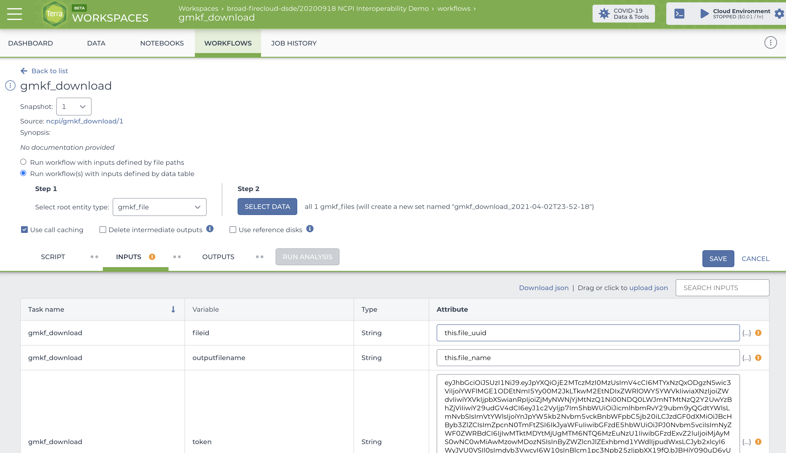

# NCPI October 2021 Interop Demo

## Background

The [NCPI](https://anvilproject.org/ncpi) effort was created in October of 2019
to facilitate interoperability among the genomic analysis platforms established by
the NCI, NHGRI, NHLBI, the NIH Common Fund, and NCBI.  It is a collaboration between NIH representatives, platform team members, and researchers running cross-platform research efforts to inform and validate the interoperability approaches.

From a researchers' standpoint the 5 groups are making it easier to work across
datasets and projects in the Terra and Seven Bridges cloud analysis platforms.
Because of NCPI and the interoperability it has promoted, researchers can use
a Terra or SBG environment of their choice to access *all* NCPI data.

Previous to the NCPI effort, researchers had the choice of applying for dbGaP
access for datasets and then either 1) downloading the files to their local
institution or 2) using specific environments for specific datasets (e.g.
Cavatica for GMKF data, Terra for AnVIL data).  This made it harder to
ask scientific questions *across* datasets.

NCPI has improved interoperability between NIH systems by:
* promoting the adoption of the NIH RAS Passport system for authN/Z, this gives a single-signon for researchers with authorization information from dbGaP
* promoting the use of GA4GH DRS for making accessing data on the cloud seamless regardless of computational platform a researcher is using
* promoting alignment of policies between NCPI systems to allow for researchers to work across them

As of October 2021, the NCPI systems are linked together using RAS+DRS.  This
means a researching working in Terra or SBG can access >11PB of 'omics data from
AnVIL, BioData Catalyst, CRDC, and Kids First in a single workspace for the first time.

## About this Repo

This repository is essentially a tutorial showing how I was able to leverage the
NCPI system interoperability to start the initial phases of Melissa Wilson's
["Sex as a Biological Variable"](https://docs.google.com/document/d/1y7Mt0JFA4REp2IELlWAVwiIrq_6i7_n3tQOpoxzMeWI/edit#heading=h.1vxylonbp5xz) use case.  NCPI uses researcher use cases like
this one to drive its work.  I did the following for this demonstration:

0. I picked a single dbGaP project from AnVIL, BDCat, CRDC, and Kids First that included both WGS data (bams and crams) and sex annotations.  I applied for access in dbGaP (for those needed).
0. For each project, I browsed the respective portal and downloaded manifests (GMKF and CRDC) or clicked the export to Terra button directly
0. I ran my script to convert manifests to TSV data models that Terra could understand for GMKF and CRDC, including DRS URIs
0. I uploaded those to the same Terra workspace that I sent AnVIL and BDCat data to through the 'send to Terra' buttons
0. I wrote a WDL workflow that does a basic QC step which is the first step in Melissa Wilson's XYAlign pipeline (coverage)
0. I parameterized the workflow with a subset of files and ran it

This is simple but it shows a few key things:

* I could run a workflow in Terra on data I was authorized to use from AnVIL, BDCat, CRDC, and Kids First
* no data was duplicated and paid for by me, Terra understood how to use DRS to stream in data on demand from the same cloud/region (AnVIL, BDCat, CRDC) or over the Internet from AWS without charge.  Not needing to make copies of data to work with them save huge amounts of time and money
* the total data available for these platforms is ~11PB, if I was authorized to access all those projects I could, in theory, use this approach to access all data from each of them

My hope is others can use this basic approach to access the portion of the ~11PB
of data that makes sense for their research and work with it easily in Terra.

## Dependencies

For local development (say you want to extend the scripts I used to process
the manifest files) you need Docker (along with `docker-compose`) setup and running on your computer.

If you just want to run these scripts you will also need to run these
through docker-compose or figure out the dependencies to run outside of Docker (Python plus
a few libraries, easy).

Once you get your manifests processed to something ready for use on the cloud you need:
* a [Terra.bio](https://app.terra.bio) account
* connection in Terra to authorization for each system (AnVIL, BDCat, CRDC, and Kids First)
* the workflow uploaded to Terra, see 

## Running

To run the environment that has all the dependencies installed:

- `git clone https://github.com/briandoconnor/ncpi-interop-demo.git`
- `docker-compose up --build` to build and launch a Docker environment

## Connecting

Once you have the Docker running, you can connect using:

```
# connect from your computer terminal
$> ./connect.sh

# now go to the working directory with my script
root@02d2b8fce3af:~# cd python/scripts/python_downloading_script/

```

## Python Download Script Usage

I have a basic script located in `cd python/scripts/python_downloading_script/download.py`
that does the download.  Here's an example of how to run it.

### Get Your GMKF Token

Go to the [GMKF Data Portal](https://portal.kidsfirstdrc.org/dashboard) and
log in with whatever ID you want to use.  Then go to your profile and
make sure you connect with the Data Repositories (typically you'll use
your eRA Commons account to do this) and (optionally) connect to your
Cavatica account.  


Once you've logged in, open up the developer tools in Chrome and look for a
`token?fence=gen3` request.  You'll need to copy the `authorization: Bearer`
token and use this with Python script in this repo to download data. I'm
not sure how long the token is good for but it seems to work for at least
24 hour.  You'll need to copy all the text after "Bearer " in this image.


### Get the File IDs

Now that you have your token, the next step is to use the
[file repository](https://portal.kidsfirstdrc.org/search/file)
to find data of interest and then download a manifest.

Select what you want and then click "File Manifest" to download
a manifest that includes the File UUIDs that you'll need to use
with the downloader tool.

Here's an example manifest:

```
File ID	Latest DID	File Name	Data Type	File Format	Experiment Strategy	Participants ID	Proband	Family Id	Sample External ID	Aliquot External ID
GF_49ZVHR6H	53d7bfde-86b2-4bd9-ba4c-27c1733e3180	34be3f7d-eda9-40cf-8325-0d14cf0fbd4d.strelka.PASS.vep.vcf.gz	Annotated Somatic Mutations	vcf	WGS, WGS	PT_AW8WV14Y	Yes	--	7316-179, 7316-179	390634, 1030630
```

What you need is the `Latest DID` here for use with the download script.

### Downloading Data

Now that you have your token and one or more File UUIDs, you can then use
the download script.  Connect to the running Docker container using then connect
script and change dir to the script dir.  Then set your token as a shell
variable, and, finally, call the downloader:

```
$> ./connect.sh

root@02d2b8fce3af:~# cd python/scripts/python_downloading_script/

root@9e01a5ba0b34:~/python/scripts/python_downloading_script# export token=eyJhbGciO...

root@9e01a5ba0b34:~/python/scripts/python_downloading_script# python download.py --token $token --fileid 53d7bfde-86b2-4bd9-ba4c-27c1733e3180 --outputdir temp
getting access token
getting signed URL
getting filename from DRS server

root@9e01a5ba0b34:~/python/scripts/python_downloading_script# ls -lth temp/
total 840K
-rw-r--r-- 1 root root 839K Apr  2 22:41 34be3f7d-eda9-40cf-8325-0d14cf0fbd4d.strelka.PASS.vep.vcf.gz

```

You can see the vcf file downloaded to the `temp` directory.

## Docker Image

I build the Python image on [quay.io](https://quay.io/repository/briandoconnor/ncpi-interop-demo?tab=settings)
under `briandoconnor/ncpi-interop-demo:latest`.  You can get it with:

    docker pull quay.io/briandoconnor/ncpi-interop-demo:latest

## WDL

I created a simple WDL in `python/scripts/python_downloading_script/download.wdl`

You can see the image below for how I configured it in the workspace below.




## Terra Workspace

I created a private workspace to try out this process, see
[20200918 NCPI Interoperability Demo](https://app.terra.bio/#workspaces/broad-firecloud-dsde/20200918%20NCPI%20Interoperability%20Demo).
You need to be added to the workspace to access it, look for the `gmkf_file`
table under the data tab.

If you want to transform the manifest from the GMKF portal and load it into your
own workspace this is what you need to make the above manifest look like:

```
entity:gmkf_file_id	file_uuid	file_drs_uri	file_name	data_type	file_format	experiment_strategy	participants_id	proband	family_id	sample_external_id	aliquot_external_id
GF_49ZVHR6H	53d7bfde-86b2-4bd9-ba4c-27c1733e3180	drs://dg.F82A1A:53d7bfde-86b2-4bd9-ba4c-27c1733e3180	34be3f7d-eda9-40cf-8325-0d14cf0fbd4d.strelka.PASS.vep.vcf.gz	Annotated Somatic Mutations	vcf	WGS, WGS	PT_AW8WV14Y	Yes	--	7316-179, 7316-179	390634, 1030630

```

You can get the DRS prefix using information in [this](https://docs.google.com/document/d/1Wf4enSGOEXD5_AE-uzLoYqjIp5MnePbZ6kYTVFp1WoM/edit#heading=h.qiwlmit3m9) document.

You can then use the upload "+" icon in the data tab of Terra to upload and
create this table.  Notice I included a DRS URI... Terra doesn't understand
this right now but in the future it will.

If you look under the workflows tab you'll then see the WDL setup and you can launch it on the gmkf_files table.

## The Future

In the future we expect Terra to provide the ability to account link
with GMKF and to understand how to resolve DRS URIs pointing to data
in GMKF.  When this happens, we expect users will migrate off of running
this download tool to manually setup and download files from GMFK.

## Python Version

See the [official python images](https://hub.docker.com/_/python) on DockerHub
as well as the [releases of Debian](https://wiki.debian.org/DebianReleases).  I'm
using Debian Buster and Python 3 as the basis for the Python environment that gets
launched:

    python:3-buster

It's probably a good idea to use a specific version number of Python when
writing real scripts/services.


## Dev Environment Origins

This project dev environment is inspired by, and forked from, this blog post:

**🐳 Simplified guide to using Docker for local development environment**

_The blog link :_

[https://blog.atulr.com/docker-local-environment/](https://blog.atulr.com/docker-local-environment/)
